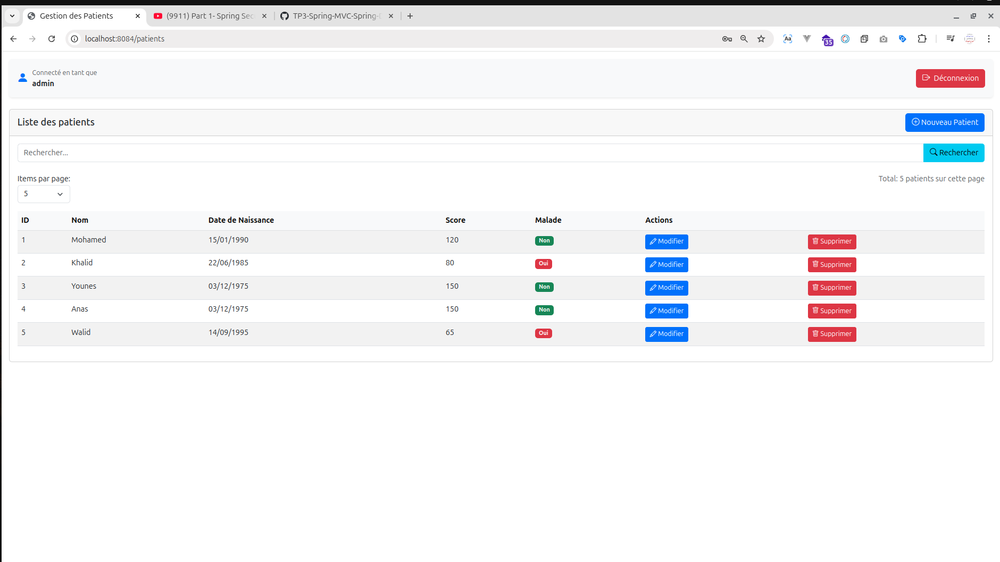

# OUAMMOU MOURAD

# Patient Management System - Spring Boot


Application web complète pour la gestion des patients avec authentification sécurisée et interface intuitive.

## Fonctionnalités clés

### Gestion des patients
- Création de fiches patients détaillées
- Recherche avancée avec filtres multiples
- Mise à jour des informations médicales
- Suppression sécurisée avec confirmation

### Sécurité avancée
- Rôles hiérarchiques :
  - `ADMIN` : Accès complet + gestion utilisateurs
  - `USER` : Consultation seule
- Authentification JWT/BCrypt
- Protection CSRF/XSS intégrée

## Stack Technique

| Composant       | Technologies                                                                 |
|-----------------|------------------------------------------------------------------------------|
| **Backend**     | Spring Boot 3 • Spring MVC • Spring Data JPA • Hibernate                     |
| **Frontend**    | Thymeleaf 3 • Bootstrap 5 • Font Awesome                                     |
| **Sécurité**    | Spring Security 6 • OAuth2 • BCrypt • JWT                                   |
| **Base de données** | MySQL 8 • PostgreSQL • H2 (dev)                                          |

## Galerie

### Interface Utilisateur
| Page de connexion | Dashboard patient |
|-------------------|-------------------|
|  |  |

### Espace Administrateur
| Gestion patients | Ajout patient |
|------------------|---------------|
|  |  |

| Confirmation suppression | Détails patient |
|--------------------------|-----------------|
|  |  |

## Installation
```bash
git clone https://github.com/MouradOuammou/TP3-Spring-MVC-Spring-Data-JPA-Thymeleaf
cd TP3-Spring-MVC-Spring-Data-JPA-Thymeleaf
